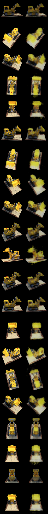

# simple-nerf-rust

> A simple implementation of NeRF in Rust

## Features

- [x] Being simple as a pure Rust library
- [x] Providing an example of execution

## Run the Experiment

```shell
cargo r -r --example experiment
```

### The Output

1. [evaluation-output.json](./artifacts/experiment/evaluation-output.json)
2. [collage.png](./artifacts/experiment/collage.png)

    

3. Terminal logs:

    ```plaintext
    Trained on 85 items ┃ 10000 steps ┃ 0.9 steps/s ┃ 03:13:14                                         
    Testing on 21 items
    Item 000 ┃ PSNR = 24.87 dB
    Item 001 ┃ PSNR = 19.66 dB
    Item 002 ┃ PSNR = 20.36 dB
    Item 003 ┃ PSNR = 20.55 dB
    Item 004 ┃ PSNR = 20.92 dB
    Item 005 ┃ PSNR = 22.77 dB
    Item 006 ┃ PSNR = 20.97 dB
    Item 007 ┃ PSNR = 19.82 dB
    Item 008 ┃ PSNR = 21.33 dB
    Item 009 ┃ PSNR = 22.95 dB
    Item 010 ┃ PSNR = 17.53 dB
    Item 011 ┃ PSNR = 23.05 dB
    Item 012 ┃ PSNR = 23.70 dB
    Item 013 ┃ PSNR = 20.59 dB
    Item 014 ┃ PSNR = 19.67 dB
    Item 015 ┃ PSNR = 21.10 dB
    Item 016 ┃ PSNR = 20.07 dB
    Item 017 ┃ PSNR = 23.42 dB
    Item 018 ┃ PSNR = 20.06 dB
    Item 019 ┃ PSNR = 25.89 dB
    Item 020 ┃ PSNR = 20.24 dB
    Rendering time ┃ 0.131 sec ┃ 160.61 FPS
    Collage is saved at "artifacts/experiment/collage.png"
    ```

## License

- [MIT](./LICENSE)

## Credits

- [GitHub bmild/nerf](https://github.com/bmild/nerf)
